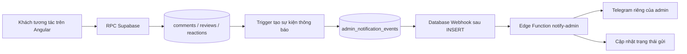

# Kế hoạch thông báo quản trị — FC Chẹp Chẹp

Ngày lập: 08/10/2026. Đây là kế hoạch, chưa triển khai notification hoặc gửi tin nhắn.

## 1. Mục tiêu và phạm vi

Admin nhận thông báo trên Telegram khi có bình luận, đánh giá và cảm xúc mới, kể cả khi không mở website. Dùng project Supabase hiện tại `gbjtvclrciqgiwvsutto`, giữ Angular/Vercel và các RPC tương tác đang chạy.

Chọn Telegram cho bản đầu; email là bước tùy chọn sau. Chưa thêm trang `/admin`, nút xóa bài trong Telegram, CAPTCHA hoặc cron giữ dự án hoạt động. Kiểm duyệt vẫn thực hiện trong Supabase Dashboard.

Hiện website chỉ có visitor ẩn danh, chưa có tài khoản admin ở frontend. Vì vậy “người ngoài tương tác” được hiểu là mọi tương tác khách hợp lệ; admin tự nhập tên trên website cũng được tính. Nếu sau này muốn loại trừ thao tác của admin, dùng danh sách visitor ID được cấu hình phía server, không dựa vào tên hiển thị.

## 2. Quy tắc thông báo đề xuất

| Sự kiện | Cách thông báo |
| --- | --- |
| Bình luận mới, chưa bị ẩn | Gửi ngay: tên, cầu thủ, nội dung, thời gian |
| Đánh giá mới, chưa bị ẩn | Gửi ngay: tên, số sao, góp ý, thời gian |
| Thêm cảm xúc mới | Gửi ngay nếu trong giới hạn bên dưới |
| Bỏ cảm xúc | Không thông báo |
| Admin ẩn/xóa/hiện lại bài | Không thông báo như bài mới |
| Dữ liệu đã có trước khi bật hệ thống | Không gửi lại |

Mặc định cho cảm xúc: tối đa một thông báo cho cùng visitor + đối tượng trong 15 phút; tối đa 10 thông báo cảm xúc trong một giờ cho toàn đội. Các loại cảm xúc dùng chung giới hạn này. Đây là giá trị đề xuất, cấu hình được phía server. Bình luận/đánh giá không bị gộp vào giới hạn cảm xúc.

Đây là **giới hạn thông báo**, không thay giới hạn ghi tương tác hiện có. Các cảm xúc hợp lệ vẫn lưu và tính số đếm, kể cả khi thông báo bị giới hạn. Thao tác thêm/bỏ/thêm liên tục không làm điện thoại admin rung liên tục.

Không cần lịch tổng hợp ở bản đầu. Tổng hợp cảm xúc mỗi ngày hoặc retry tự động theo lịch sẽ là bước riêng nếu được yêu cầu.

## 3. Kiến trúc



Trigger chỉ tạo bản ghi sự kiện trong cùng transaction với tương tác. Gọi Telegram qua webhook/Edge Function sau commit, không gọi mạng trong RPC đang xử lý bình luận. Telegram bị lỗi không làm mất bài đã lưu.

Supabase Database Webhooks hỗ trợ INSERT/UPDATE/DELETE và chạy HTTP bất đồng bộ; ở đây chỉ đăng ký **INSERT trên bảng sự kiện**, tránh gửi lặp khi cập nhật trạng thái. [Tài liệu Database Webhooks](https://supabase.com/docs/guides/database/webhooks).

Bảng `public.admin_notification_events` bật RLS và thu hồi toàn bộ quyền của `anon`/`authenticated`. Chỉ database trigger, Edge Function dùng credential server và admin Dashboard được truy cập. Chọn schema public để Edge Function dùng Data API mà không phải expose `fc_private`; tên public không đồng nghĩa dữ liệu được công khai.

Trường dự kiến: `id`, `source_table`, `source_id`, `event_type`, `target_type`, `target_id`, `visitor_id`, `created_at`, `status`, `attempts`, `locked_until`, `sent_at`, `telegram_message_id`, `last_error`. Unique theo `source_table + source_id + event_type` để không tạo hai sự kiện cho cùng một lần INSERT.

Không lưu lại toàn bộ nội dung bình luận trong bảng sự kiện. Khi xử lý, đọc bản ghi nguồn để kiểm tra bài còn tồn tại/chưa ẩn, rồi dựng tin nhắn. Nếu nguồn đã xóa/ẩn hoặc cảm xúc đã bị bỏ trước khi gửi, đánh dấu `suppressed` và không gửi.

## 4. Bảo mật và định danh

- Bot token và khóa xác thực webhook lưu trong Supabase Secrets; không nằm trong Angular environments, bundle Vercel, GitHub hoặc chat. [Tài liệu Secrets](https://supabase.com/docs/guides/functions/secrets).
- Function nhận POST và kiểm tra secret riêng trong header; không nhận quyền gửi từ publishable key của website. Nếu tắt `verify_jwt` để nhận webhook, xác thực header là bắt buộc và phải kiểm thử trước khi bật webhook. [Securing Edge Functions](https://supabase.com/docs/guides/functions/auth).
- Sau xác thực, Function kiểm tra schema/table/event và ID, rồi đọc sự kiện thật trong database. Không gửi tin theo nội dung tùy ý trong HTTP payload.
- Dùng credential server của Edge Function để claim/cập nhật sự kiện; không yêu cầu admin gửi service_role key vào chat. Các RPC claim/retry chỉ cấp EXECUTE cho role server.
- Không ghi token, Authorization header hoặc session vào log. Gửi nội dung dạng plain text, không dùng parse_mode với chuỗi người dùng chưa escape.
- Telegram chat ID cố định phía server, không nhận từ người dùng website.

Bình luận/đánh giá có `display_name` lúc gửi. Cảm xúc hiện chỉ có visitor UUID: bản đầu thông báo “THẦY vừa nhận một lượt yêu thích”, không hiện tên người thả, không lấy tên từ frontend để suy đoán. Tên cầu thủ tra bằng bản mapping ID → tên sinh từ `src/data/members.json`; ID không có trong mapping thì hiển thị ID, không làm hỏng quá trình gửi.

## 5. Nội dung tin nhắn

Ví dụ bình luận:

```text
FC Chẹp Chẹp | Bình luận mới
Cầu thủ: THẦY
Người gửi: Minh
Nội dung: Đá nhiệt tình quá anh!
Thời gian: 08/10/2026 14:30 (giờ Việt Nam)

Xem đội hình: <link website đến #members>
Quản lý bình luận: <link Supabase Dashboard>
Mã bình luận: <id>
```

Đánh giá có điểm dạng “4/5 sao”; cảm xúc dùng nhãn tiếng Việt của năm loại hiện có. Thời gian format `Asia/Ho_Chi_Minh`. Link website cấu hình bằng `SITE_URL`; link kiểm duyệt dẫn Dashboard, cần đăng nhập tài khoản Supabase có quyền. Bản đầu không có nút xóa tự động hoặc link mang credential quản trị.

Telegram Bot API cung cấp `sendMessage` và kết quả gửi để lưu message ID. [Telegram API](https://core.telegram.org/bots/api#sendmessage).

## 6. Độ tin cậy, retry và vận hành

Các trạng thái: `pending`, `processing`, `sent`, `failed`, `uncertain`, `suppressed`.

Claim sự kiện bằng RPC atomic và lease trước khi gửi; hai webhook đồng thời không cùng gửi một sự kiện. Sự kiện đã `sent` hoặc `suppressed` không xử lý lại. Giới hạn tần suất cảm xúc cũng kiểm tra atomic phía database, không chỉ trong bộ nhớ Function.

Nếu Telegram xác nhận thành công, lưu message ID và `sent_at`. Nếu Telegram trả lỗi rõ ràng, lưu `failed` và thông báo lỗi đã loại bỏ thông tin nhạy cảm. Nếu timeout sau khi gửi request, có thể Telegram đã nhận: đánh dấu `uncertain`, không tự retry mù quáng.

Không hứa gửi đúng một lần tuyệt đối: Telegram có thể đã gửi tin trong khi việc ghi trạng thái vào database thất bại. Lease và unique giúp giảm trùng, nhưng không loại bỏ hoàn toàn cửa sổ này.

Bản đầu không dùng scheduler: admin xem `pending`/`failed`/lease hết hạn trong Dashboard và dùng thao tác retry có hướng dẫn, theo lô nhỏ. Không mặc định coi webhook là có retry bảo đảm. Retry thủ công phải xác thực bằng secret, kiểm tra trạng thái và bỏ qua `sent`; với `uncertain`, admin kiểm tra Telegram trước.

Nếu muốn retry tự động ngay cả khi webhook bị mất và không có khách mới, bổ sung worker theo lịch ở bước sau. Worker đó phục vụ gửi lại notification, không phải cron giữ project free hoạt động; cần thống nhất riêng trước khi thêm.

Retention đề xuất: dọn các sự kiện terminal (`sent`, `suppressed`) quá 30 ngày bằng thao tác Dashboard/SQL có hướng dẫn; không tự xóa `failed`, `uncertain` hoặc sự kiện chưa xử lý. Chưa thêm cron dọn dữ liệu. Nếu Supabase bị paused, khôi phục trong Dashboard rồi rà sự kiện chưa gửi; không hứa thông báo hoạt động trong thời gian paused.

## 7. Thứ tự triển khai và phân công

| Bước | Việc thực hiện | Kết quả cần có |
| --- | --- | --- |
| 1. Admin chuẩn bị | Tạo bot qua BotFather; mở bot và nhấn Start; chọn nhận riêng hoặc nhóm admin | Bot token đặt trực tiếp vào Secrets và chat ID được xác định |
| 2. Viết SQL | Thêm migration mới cho bảng sự kiện, trigger, quyền, claim/retry và giới hạn cảm xúc | Chạy được trên PostgreSQL thử nghiệm, không sửa migration cũ đã deploy |
| 3. Viết Function | Xác thực webhook, tra dữ liệu nguồn, format tin, gọi Telegram, lưu trạng thái | Test bằng Telegram mock; token không xuất hiện trong log |
| 4. Tạo cấu hình và hướng dẫn | Secrets mẫu chỉ ghi tên biến, config function và mapping cầu thủ | Admin làm được mà không phải gửi secret vào chat |
| 5. Bật trên Supabase | Deploy Function → đặt Secrets → chạy migration → cấu hình webhook cuối cùng | Luồng được bật khi các thành phần sẵn sàng |
| 6. Kiểm tra thật | Khách ở trình duyệt riêng gửi bình luận, đánh giá, cảm xúc | Admin nhận đúng tin trên điện thoại khi website đã đóng |
| 7. Bàn giao | Hướng dẫn kiểm duyệt, retry, tắt webhook, đổi bot token, dọn dữ liệu | Có thể vận hành từ Dashboard |

Bot tạo và cấu hình qua [BotFather](https://core.telegram.org/bots/features#botfather). Admin phải mở bot/Start trước khi bot gửi vào chat riêng. Chat ID và token xác định trong quy trình setup riêng, không chèn token vào URL trình duyệt hoặc ảnh chụp.

Secrets dự kiến: `TELEGRAM_BOT_TOKEN`, `TELEGRAM_CHAT_ID`, `NOTIFICATION_WEBHOOK_SECRET`, `SITE_URL`. Hướng dẫn sẽ nêu rõ credential server Supabase được Function sử dụng và cách cấu hình theo môi trường; không hard-code vào source.

Việc deploy Edge Function cần quyền project Supabase qua Dashboard hoặc CLI đăng nhập. Publishable key hiện có chỉ đủ cho chức năng khách, không đủ để deploy, tạo webhook hay đặt Secrets. Không cần deploy Vercel chỉ để bật thông báo server nếu frontend vẫn dùng cùng project.

## 8. File dự kiến tạo/sửa khi triển khai

- `supabase/migrations/<timestamp>_admin_notifications.sql`: bảng, quyền, trigger, claim/retry/rate limit.
- `supabase/functions/notify-admin/index.ts`: nhận webhook và xử lý Telegram.
- Các module nhỏ cùng thư mục cho format, client Telegram và mapping cầu thủ nếu cần để kiểm thử.
- `supabase/config.toml`: cấu hình xác thực Function, nếu chưa có thì tạo tối thiểu.
- `supabase/functions/.env.example`: tên biến với placeholder, không chứa token thật.
- Tests database và Function, mở rộng script hiện có phù hợp với môi trường chạy.
- `markdown/admin-notifications-setup.md` và README: cách bật, tắt, retry, kiểm tra lỗi.

## 9. Tiêu chí nghiệm thu

- Bình luận mới và đánh giá mới gửi đúng tên, nội dung, target, sao, giờ Việt Nam; không gửi trước khi tương tác lưu thành công.
- Khách không cần tài khoản Telegram; chỉ admin nhận thông báo. Admin đóng website vẫn nhận được, tùy thiết lập thông báo/mute của Telegram trên điện thoại.
- Thêm cảm xúc gửi đúng nhãn/đối tượng; bỏ cảm xúc không gửi; thêm/bỏ/thêm trong cửa sổ giới hạn không spam.
- Webhook trùng và hai request đồng thời không cùng claim; client anon/authenticated không đọc hoặc chỉnh bảng sự kiện.
- Request sai secret, payload giả và ID không tồn tại bị từ chối; không lộ token qua response/log/bundle.
- Nội dung HTML, Markdown, ký tự đặc biệt và tiếng Việt được gửi dạng chữ, không tạo markup ngoài ý muốn.
- Bài đã ẩn/xóa trước khi Function xử lý không gửi; bài đã gửi Telegram trước khi admin ẩn không được coi là có thể tự thu hồi.
- Telegram lỗi/timeout: giữ sự kiện để kiểm tra/retry, không làm mất bình luận; kiểm tra cả `failed`, `uncertain` và lease hết hạn.
- Khôi phục dự án hoặc bật lại webhook không gửi hàng loạt dữ liệu cũ mà không có thao tác retry rõ ràng.
- `npm run build` vẫn đạt; test trên chat thử trước khi bật nhận thật. Việc gửi tin thử thực hiện khi đã có yêu cầu triển khai và chat đích được xác định.

Hoàn thành bản đầu khi comment/review và cảm xúc có giới hạn hoạt động thật, quyền đã kiểm tra, admin có hướng dẫn xử lý lỗi. Email, tổng hợp theo ngày và nút kiểm duyệt trên Telegram là phần mở rộng sau.
